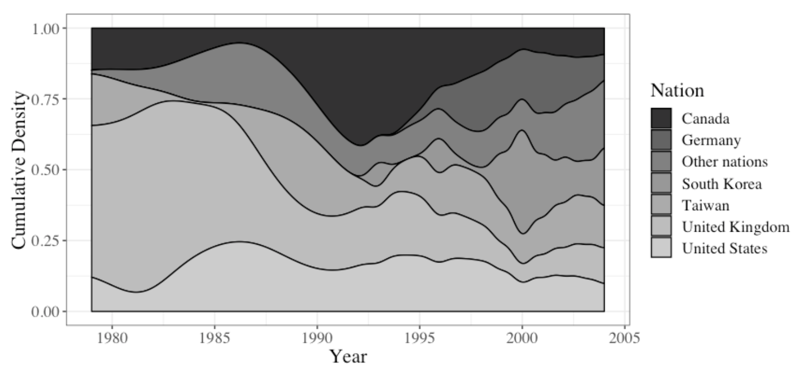

# Patent text similarity and cross-cultural venture-backed innovation

Tensorflow-Keras neural networks of venture capital/corporate innovations research

Tools used: Tensorflow/Keras, PlaidML (for GPU), and Hyperas for hyperparameter tuning.

This repository contains a series of predictive objects made using the data from my finance research paper ["Patent text similarity and cross-cultural venture-backed innovation,"](https://www.sciencedirect.com/science/article/abs/pii/S2214635019302059) which is currently under embargo for publication in the Journal of Behavioral and Experimental Finance's special issue on AI in finance. An earlier version of the paper that has the exact details of the methodology behind the research is located [here](https://drive.google.com/open?id=1PGn47EohzfwG4BcG6TkbC6tD7LqjtsJ4).

The research finds that venture-backed portfolio companies which produce patents that are textually more similar to those of their industry peers produce more patents and higher quality patents, as quality is measured by the number of citations by other patents. 4.9 million cosine similarity measures between the patents of 961 venture-backed portfolio companies from 28 different nations provide results that are able to generalize beyond the English language with the addition of a cultural-linguistic distance measure from [West and Graham (2004)](https://scholar.google.com/scholar?hl=en&as_sdt=0%2C9&q=west+and+graham+2004+linguistic+distance&btnG=).

Industry categories are defined by Thomson Reuters and split into six categories: biotechnology, communications & media, computer-related, medical/health/life sciences, non-high tech, and semiconductor-related types of patents. To validate these categories, I fit a bayesian latent Dirichlet allocation (LDA) topic modeling algorithm to the patent text and constrained the model to find six different distributions of words, or topics, among the patents. I then matched the LDA-derived topics to the Thomson Reuters topics using the top ten most frequently occurring terms in each LDA-derived topic. Finally, I took the KL distance between the two measures and was therefore able to control for aggregate measurement error.

As for the VC data, it is shown in this density plot of VC deals by nation in the sample. The data in the plot is for a slightly larger sample of 1294 VC deals of which the 961 VC deals in this data are a subset. Though the represesntation of nations by year varies, the effects of the dot-com bubble in 1999 is clearly visible in the plot:

Although inferential statistics on data such as this are the standard in academic business research, a great deal of econometrics applies to neural networks. My dissertation chapters each made use of left-censored tobits that are essentially inferential versions of ReLUs from neural networks. [A co-authored journal publication of mine](https://drive.google.com/file/d/1YSCRUzk6HGscBfy7aj-S1EEhfUfNJ0IQ/view?usp=sharing) makes use of structural equation models, [which are essentially inferential versions of causal Bayesian neural networks](http://causality.cs.ucla.edu/blog/index.php/2012/12/07/on-structural-equations-versus-causal-bayes-networks/) where the path weights are of interest, rather than predictions on new data.

Despite the focus in finance research on such inferential statistics, predictive analytics are increasingly being used in practice and in the area of venture capital. For example, [Google Ventures](https://www.axios.com/scoop-inside-google-venure-capital-machine-ce7782f2-a9b4-4556-8feb-0914e77ac021.html) actively uses machine learning to predict whether or not a venture capital investment should be undertaken. [Other](https://www.wsj.com/articles/signalfire-raises-330-million-for-data-centric-venture-capital-1494415804) venture capital firms are beginning to follow suit as well as [venture capital shifts overseas](https://venturebeat.com/2018/10/05/u-s-share-of-global-venture-capital-fell-more-than-20-in-5-years/amp/). To that end, and to take the opportunity to apply neural networks to [research-quality data](https://simplystatistics.org/2019/05/29/research-quality-data-and-research-quality-databases/), I have made predictive objects from my research available for practitioners.
